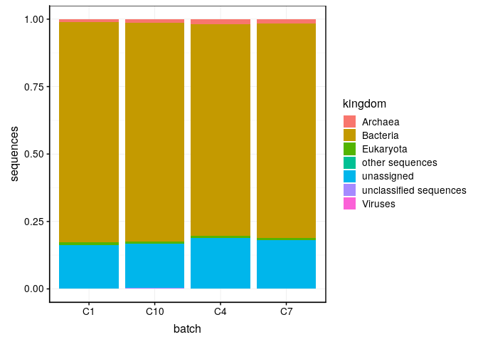

<!-- README.md is generated from README.Rmd. Please edit that file -->
Analyse métagénomique de type shotgun sur 4 communautés microbiennes
====================================================================

Guyliann Engels & Philippe Grosjean
-----------------------------------

Résumé
------

Ces données proviennent directement des recherches menées par le chercheur de l'univeristé de Mons David Gillan et ses collaborateurs:

[Paleomicrobiology to investigate copper resistance in bacteria : isolation and description of Cupriavidus necator B9 in the soil of a medieval foundry](http://di.umons.ac.be/details.aspx?pub=0a0de102-c145-403f-9e1c-8ad4fdc1fc39)

Le document mis à votre dispositon comprend deux feuilles au sein du fichier excell :

-   raw
-   phylum\_raw

Tâches
======

-   Organisez votre projet en un ensemble de sous-dossiers : analysis, R, images,...

-   Créez un rapport d'analyse organisé en section : introduction, Matériels et méthodes,...

-   Importez les données présentes dans le dossier data dans le fichier *shot\_gun\_dcg.xlsx*

-   De quel type de tableau de données s'agit-il ?

``` r
meta <- read("data/shot_gun_dcg.xlsx")
```

-   Reproduisez ce graphique dans votre rapport



La fonction read() importe la première feuille si vous ne spécifiez pas la feuille que vous souhaitez. La fonction read() utilise en interne la fonction read\_excel() pour importer les données au format xlsx.

-   Importez également la seconde feuille du fichier *shot\_gun\_dcg.xlsx* qui se nomme *phylum\_raw*

``` r
?readxl::read_excel
```

La fonction ci-dessous permet de prendre connaissance des formats supportés par la fonction read()

``` r
data_types()
```

-   Produisez un graphique en barre afin de représenter les données de cette seconde feuille

-   Les données brutes de cette étude se trouve dans le dossier raw (dans le dossier data), que pensez vous de ce type d'encodage de données ?

Challenges
----------

-   Tentez de reproduire dans votre rapport, la figure 2 de l'article. (Fig. 2. Composition of the bacterial communities of 4 soil samples (Bacterial Phyla) as revealed by shotgun metagenomics and MG- RAST (% of sequences normalized by the number of sequences identified as Bacteria).)
